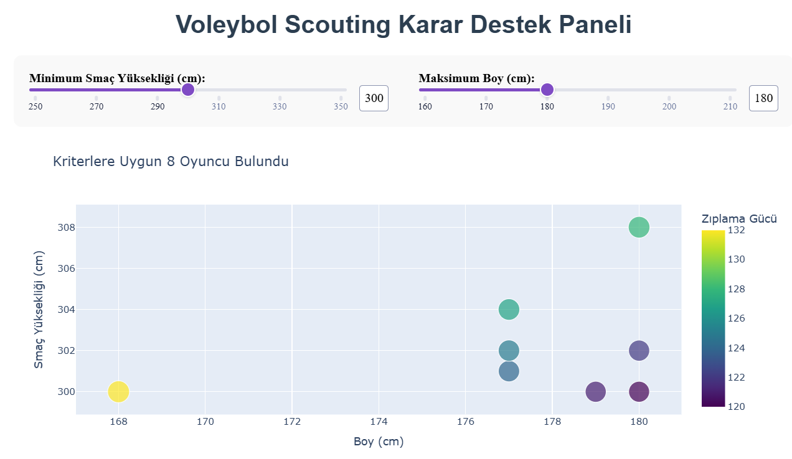
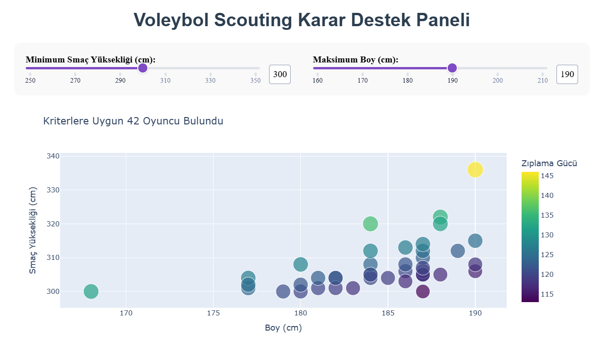
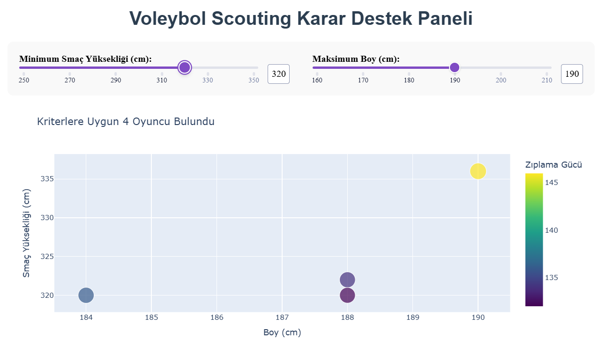

# Volleyball Scouting & Decision Support System

An interactive, data-driven scouting platform for professional volleyball coaches and recruitment teams. Analyse athlete performance metrics, benchmark squads against league standards, compare players head-to-head, and generate confidential PDF scouting reports — all from a single Jupyter-powered Dash dashboard.

---

## Features

### 1. Player Scout
Filter the full player database by minimum spike reach and maximum height. Results update in real time as a scatter plot coloured and sized by Jump Power, making it easy to spot efficient athletes who punch above their height.

### 2. Position Benchmarks
View average, top 25% (75th percentile), and elite 10% (90th percentile) thresholds for every physical metric across all five playing positions. A grouped bar chart lets you switch between Height, Spike Reach, Block Reach, and Jump Power at a click.

### 3. Player Comparison
Select any two players from the database to see a head-to-head radar chart across six normalised metrics: Height, Spike Reach, Block Reach, Jump Power, Spike Percentile, and Block Percentile. A raw-value summary table sits below the chart.

Click **Generate PDF Report** to download a formatted, confidential scouting report that includes individual metric tables with percentile ranks, a colour-coded head-to-head comparison table (winning cells highlighted green), and a written scout recommendation paragraph.

### 4. Team Analysis
Upload a CSV roster (columns: `name`, `position_number`, `height`, `spike`, `block`) to get three automated sections:

- **Squad Overview** — bar chart of players per position; missing positions highlighted in red.
- **Weakness Detection** — each player compared against position benchmark averages; below-average cells highlighted; colour-coded team score cards per position (Strong / Average / Weak).
- **Transfer Recommendations** — for every weak or missing position, the top 5 candidates from the database ranked by combined spike + block percentile, with full stats displayed.

A sample CSV download button is provided so you always know the expected format.

---

## How to Run

**1. Install dependencies**

```bash
pip install dash plotly pandas matplotlib seaborn reportlab
```

**2. Place the data file**

Ensure `clean_data.csv` is in the same directory as `Model.ipynb`. The notebook uses a relative path and will fail if run from a different working directory.

**3. Run the notebook**

Open `Model.ipynb` in Jupyter and run all cells in order:

| Cell | Purpose |
|------|---------|
| 1 | Load data, inspect columns, print basic averages |
| 2 | Position-based aggregation, compute `jump_power` metric |
| 3 | Deduplicate records, static matplotlib/seaborn scatter plot |
| 4 | `oyuncu_bul` quick-search helper function |
| 5 | `pip install reportlab` |
| 6 | Full Dash app — starts the interactive dashboard |

**4. Open the dashboard**

Navigate to `http://127.0.0.1:8060` in your browser.

---

## Dataset

**File:** `clean_data.csv`

| Column | Description |
|--------|-------------|
| `index` | Row identifier |
| `name` | Player full name |
| `date_of_birth` | Date of birth (`DD/MM/YYYY`) |
| `height` | Standing height in cm |
| `weight` | Body weight in kg |
| `spike` | Spike reach in cm (maximum jump reach while attacking) |
| `block` | Block reach in cm (maximum jump reach while blocking) |
| `position_number` | Numeric position code (see mapping below) |
| `country` | Numeric country code (e.g. 23 = Russia, 30/31 = Brazil) |

> **Note:** The raw dataset contains multiple rows per player (historical snapshots). Deduplication via `drop_duplicates('name')` is applied before any per-player analysis.

### Position Number Mapping

| Number | Position |
|--------|----------|
| 1 | Setter |
| 2 | Opposite Hitter |
| 3 | Middle Blocker |
| 4 | Outside Hitter |
| 6 | Libero |

### Derived Metrics

| Metric | Formula | Meaning |
|--------|---------|---------|
| `jump_power` | `spike − height` | Explosive jumping efficiency relative to standing height |
| `spike_percentile` | `rank(pct=True) × 100` | Spike reach rank within the deduplicated dataset |
| `block_percentile` | `rank(pct=True) × 100` | Block reach rank within the deduplicated dataset |

---

## Tech Stack

| Layer | Libraries |
|-------|-----------|
| Language | Python 3 |
| Data processing | Pandas |
| Visualisation | Plotly, Matplotlib, Seaborn |
| Dashboard framework | Dash (Plotly) |
| PDF generation | ReportLab |

---

## Project Showcases

### Athletic Anomalies
Players under 180 cm with elite jumping capacity — athletes who compensate for height with superior explosiveness.



### General Performance Distribution
Spike reach vs height across the full professional dataset.



### Elite Tier Analysis
Players with a spike reach above 320 cm — world-class physical talent.



---

## Contact

Built by a Software Engineer with a passion for volleyball analytics. Currently seeking opportunities to apply Python, data engineering, and interactive dashboard skills to help elite clubs optimise their scouting and performance analysis workflows.

**Email:** erginsen06@gmail.com
